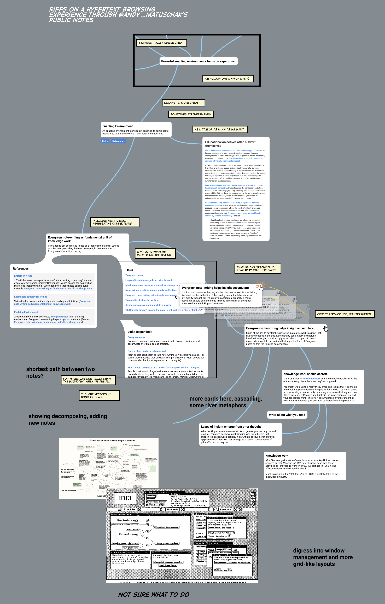
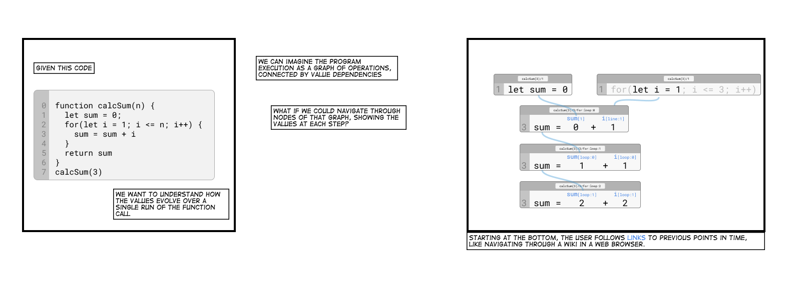
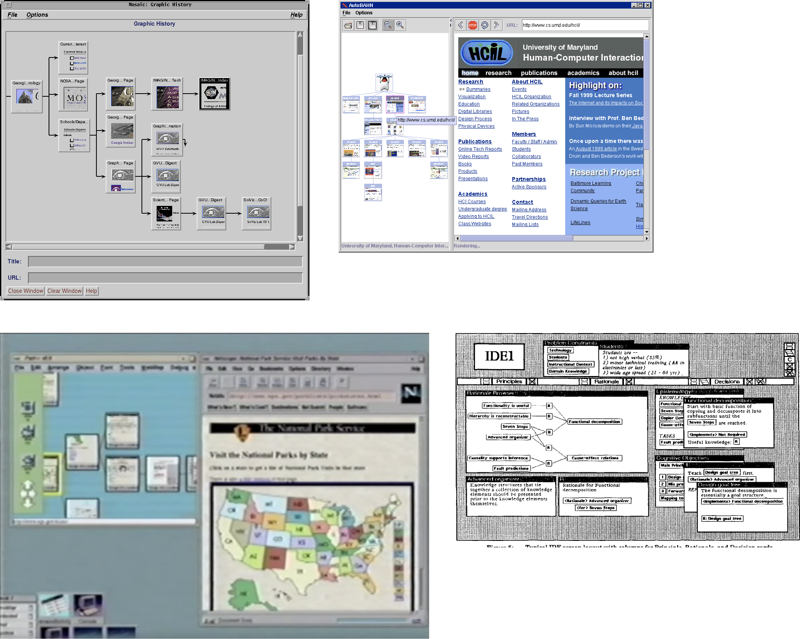

# Spatial Browser Concept

(Discussed in private Discord):

> I haven't released it, but earlier this year, inspired by Makespace, I was developing this idea of a spatial browser like this. p5stamper.com (cocreated by @supercgeek ), the roam graph view, liquidtext, and @visakanv's use of the scalper app were also inspirations. But seeing the makespace demo was what immediately got me thinking about this kind of browsing. I wanted to take that idea of clicking a link and seeing a new window open on the canvas, and see what it would be like with content designed for spatial browsing, and with more operations for decomposing/remixing the hypertext.

> Before that I was also playing around with this idea for a free-form execution graph browser. The idea is that values are links, and you can explore program traces to figure out what operations contributed to the values of functions etc.

> I collected some examples, from where I don't remember(lol), of past systems like this. I believe one of these was a smalltalk based hypertext environment:

